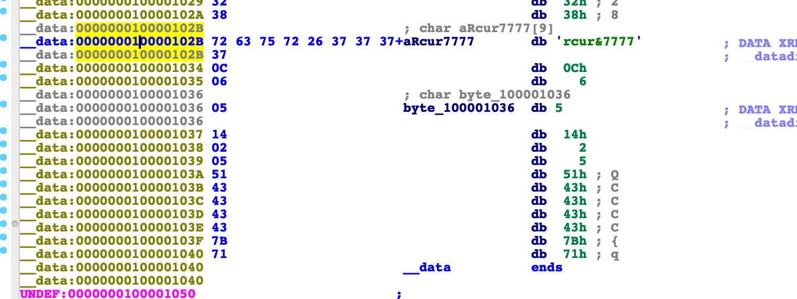
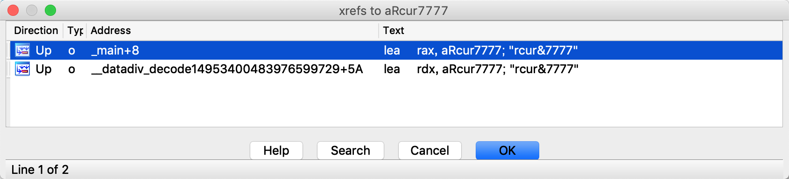
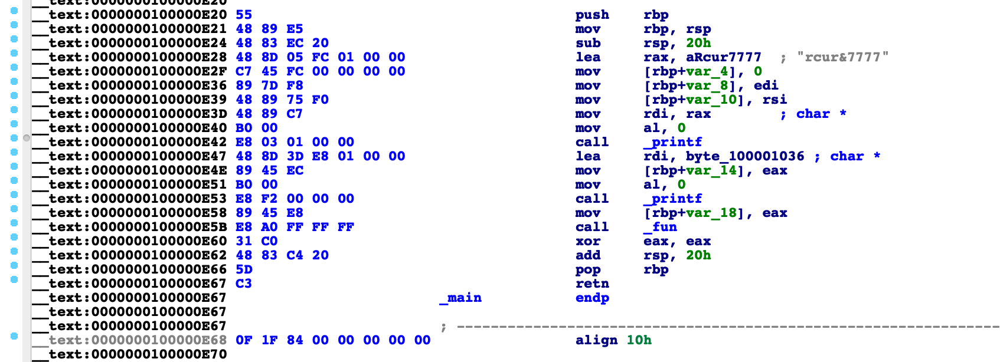
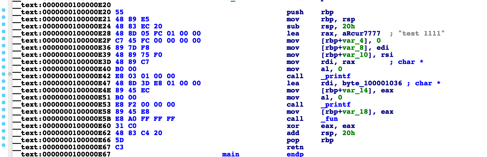
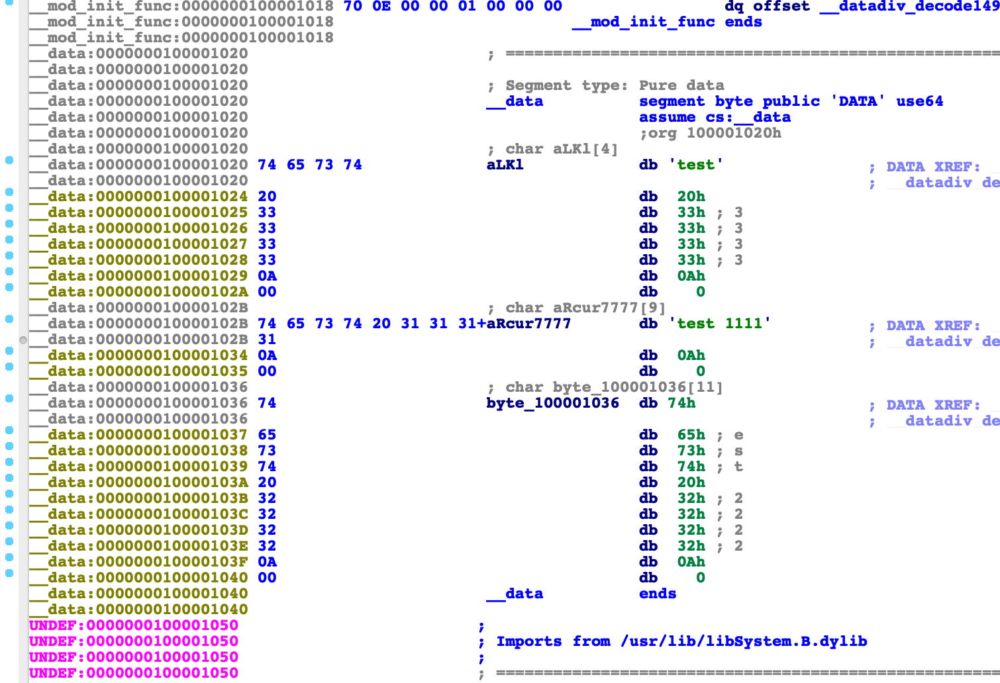
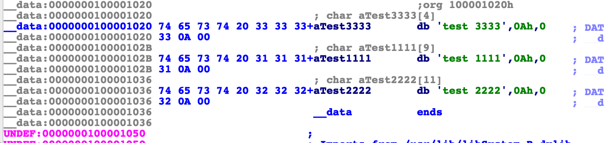
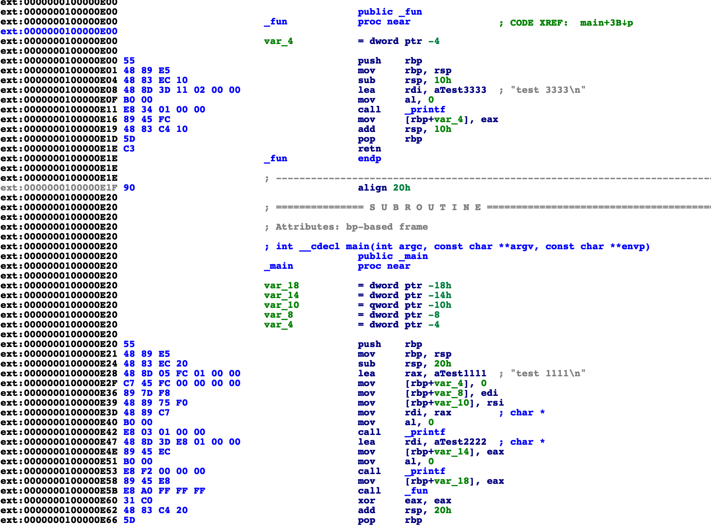

## 编译Armariris

```
git clone git@github.com:gossip-sjtu/Armariris.git
```

编译

```shell
cd Armariris
mkdir build
cd build
cmake ../ -DCMAKE_BUILD_TYPE=Release -DLLVM_TARGETS_TO_BUILD="ARM;X86;AArch64"
make -j8
```

测试文件内容如下:

```c
#include <stdio.h>

void fun(){
	printf("test 3333\n");
}

int main(int argc, char *argv[]) {
	printf("test 1111\n");
	printf("test 2222\n");
	fun();
	return 0;
}

```

使用编译好的llvm编译这个测试的文件

```shell
clang -isysroot /Applications/Xcode.app/Contents/Developer/Platforms/MacOSX.platform/Developer/SDKs/MacOSX.sdk -mllvm -sobf test.c -o test
```

使用isysroot指定sdk，然后使用`-mllvm -sobf`开启字符串混淆

## Armariris是如何进行字符串混淆的

我们直接看使用ida反汇编出来的代码

```c++
int __cdecl main(int argc, const char **argv, const char **envp)
{
  printf(aRcur7777, argv, envp);
  printf(&byte_100001036);
  fun();
  return 0;
}
```

可以看到有两个printf函数打印了一些数据出来，我们点第一个打印的字符串，双击`aRcur7777`跳转到
字符串定义位置，这个字符串在data段



这个字符串我们本来输出的是`test 1111`这里显然不是，我们查看`aRcur7777`的交叉引用，发现两处，
其中一处是main函数中的printf，另一处应该就是还原这个字符串的位置了



所以`__datadiv_decode14953400483976599729`这个函数就是还原这个字符的函数，我们看他是如何做的还原
。跳转过去按F5反编译，得到的结果如下:

```cpp
__int64 datadiv_decode14953400483976599729()
{
  bool v0; // ST23_1
  bool v1; // ST17_1
  __int64 result; // rax
  bool v3; // ST0B_1
  unsigned int v4; // [rsp+8h] [rbp-1Ch]
  unsigned int v5; // [rsp+14h] [rbp-10h]
  unsigned int v6; // [rsp+20h] [rbp-4h]

  v6 = 0;
  do
  {
    aLKl[v6] ^= 0x38u;
    v0 = v6++ < 0xA;
  }
  while ( v0 );
  v5 = 0;
  do
  {
    aRcur7777[v5] ^= 6u;
    v1 = v5++ < 0xA;
  }
  while ( v1 );
  v4 = 0;
  do
  {
    byte_100001036[v4] ^= 0x71u;
    result = v4 - 10;
    v3 = v4++ < 0xA;
  }
  while ( v3 );
  return result;
}
```

我们可以看到`aRcur7777`的还原是和6做了异或操作，那我们来验证一下是否是我们看到的这样。

`aRcur7777`的原始数据是`[0x72, 0x63, 0x75, 0x72, 0x26, 0x37, 0x37, 0x37, 0x37]`

每一位和6异或之后的结果是`[0x74, 0x65, 0x73, 0x74, 0x20, 0x31, 0x31, 0x31, 0x31]`

对于的ascii字符串就是`test 1111`

他这里做字符串混淆用的是一个很简单的原理，一个数字两次异或同一个值，得到的结果是本身的值。也就是
第一次异或就给字符串混淆了，再异或一次就把数据还原了。

## 源码分析

字符串混淆的源文件在`lib/Transforms/Obfuscation/StringObfuscation.cpp`这个位置，
实现字符串混淆的是一个`ModulePass`,关于`ModulePass`可以参考[http://llvm.org/doxygen/classllvm_1_1ModulePass.html#details](http://llvm.org/doxygen/classllvm_1_1ModulePass.html#details)
。在这个pass里面会遍历字符串，然后把字符串和生成的key异或，并替换原始的值，关键代码如下:

```cpp

// Duplicate global variable
GlobalVariable *dynGV = new GlobalVariable(M,
                                          gv->getType()->getElementType(),
                                          !(gv->isConstant()), gv->getLinkage(),
                                          (Constant*) 0, gv->getName(),
                                          (GlobalVariable*) 0,
                                          gv->getThreadLocalMode(),
                                          gv->getType()->getAddressSpace());
// dynGV->copyAttributesFrom(gv);
dynGV->setInitializer(gv->getInitializer());

std::string tmp=gv->getName().str();
//  errs()<<"GV: "<<*gv<<"\n";

Constant *initializer = gv->getInitializer();
ConstantDataSequential *cdata = dyn_cast<ConstantDataSequential>(initializer);
if (cdata) {
        const char *orig = cdata->getRawDataValues().data();
        unsigned len = cdata->getNumElements()*cdata->getElementByteSize();

        encVar *cur = new encVar();
        cur->var = dynGV;
        cur->key = llvm::cryptoutils->get_uint8_t();
        // casting away const is undef. behavior in C++
        // TODO a clean implementation would retrieve the data, generate a new constant
        // set the correct type, and copy the data over.
        //char *encr = new char[len];
        //Constant *initnew = ConstantDataArray::getString(M.getContext(), encr, true);
        char *encr = const_cast<char *>(orig);
        // Simple xor encoding
        for (unsigned i = 0; i != len; ++i) {
                encr[i] = orig[i]^cur->key;
        }

        // FIXME Second part of the unclean hack.
        dynGV->setInitializer(initializer);

        // Prepare to add decode function for this variable
        encGlob.push_back(cur);
} else {
        // just copying default initializer for now
        dynGV->setInitializer(initializer);
}

// redirect references to new GV and remove old one
gv->replaceAllUsesWith(dynGV);
toDelConstGlob.push_back(gv);

```

在替换了之后为了保证程序可以正常运行，还得加一个函数输还原字符串，还原字符串的
函数生成代码在`addDecodeFunction`中。在这里添加了`.datadiv_decode`开始的函数
加上一串随机字符串，里面进行了异或操作，将数据还原。然后将这个函数加入到了`entry`，这个在
elf文件的话，就会被加入到`.init_array`，在mach-o文件中就会被加入到`__mod_init_func`。
代码也比较简单，可以参照源码看一下。


## 还原字符串

前面讲了原理其实很简单，那么怎么还原字符串呢，其实也有很多方式，第一种是内存dump，因为他会在
初始化程序的时候就把原始字符串还原回去。但是有时候我就行静态分析，不想执行之后去dump。如果只
静态分析，也可以去人工还原字符串。但是如果字符串很多，人工还原工作量很大。其实我们还可以使用
unicorn之类的工具，模拟去执行他的指令，把字符串进行还原。

### 还原混淆字符串的思路

1. 找到所有`.datadiv_decode`开始的函数
2. unicorn分配内存，将程序的.text段和.data段映射到unicorn分配的内存中
3. 模拟执行所有`.datadiv_decode`开始的函数
4. 最后将unicorn中分配的data读出来，patch到程序中

### 使用的工具

因为不同操作系统可执行文件格式不一样。为了简单点，我们直接写一个ida插件。所以需要以下工具：

1. ida
2. python2 (因为ida里面内置的python是python2)
3. python2安装unicorn和keystone库

### 找到所有的`.datadiv_decode`开始的函数

`idautils.Functions()`可以遍历函数，遍历匹配含有`datadiv_decode`的函数，保存他们
的起始地址，代码很简单，如下:

```python
import idaapi
import idc
import idautils

for func in idautils.Functions():
    func_name = idc.GetFunctionName(func)
    if "datadiv_decode" in func_name:
        func_data = idaapi.get_func(func)
        start = func_data.start_ea
        end = func_data.end_ea
```

### unicorn分配内存

我这里分配内存的想法是直接用ida的api获取data段和text段的内容，以及起始地址，然后在
unicorn里面对于起始分配内存，将data段和text段写进去。

unicorn分配内存还是有些坑，不能直接在任意地址分配，必须得整除1024的才可以，所以需
要稍微计算一下分配的地址。这里对基地址减去对(1024 * 1024)求余的结果作为新的基地址，
然后分配内存的长度增加(1024 * 1024)，实现的代码如下

```python

def get_base_and_len(base, length):
    _base = base - (base % (1024 * 1024))
    _length = (length / (1024 * 1024) + 1) * 1024 * 1024
    return _base, _length

```

算出起始地址之后使用unicorn的`mem_map`方法分配内存即可

### 模拟执行，patch程序

模拟执行这里也比较简单，直接调用unicorn的`emu_start`方法，然后传入函数的起始地址即可开始
模拟执行，模拟执行完成之后将data段读出来，模拟执行下一个函数的时候使用这个data加载到内存中。
这样所有的`.datadiv_decode`函数执行之后data段就被还原了。将还原的data段用ida的patch去
修改掉原始的data，这个时候你看到的字符串就是原始的字符串了。

运行脚本前效果如下:



运行脚本之后效果如下:





这个时候可以选中字符串，然后按a就能得到下面的效果






### 完整代码以及示例二进制文件

代码以及二进制文件存放在[https://github.com/smartdone/re_scripts/tree/master/ida](https://github.com/smartdone/re_scripts/tree/master/ida)
其中Armariris_string_obfuscation_bypass.py是ida用来还原Armariris混淆过的字符串的插件。sample里面的test_linux_x86_64和test_macos_x86_64是示例二进制文件。

> 如果本文说的有错误的地方，请及时指正，谢谢。

